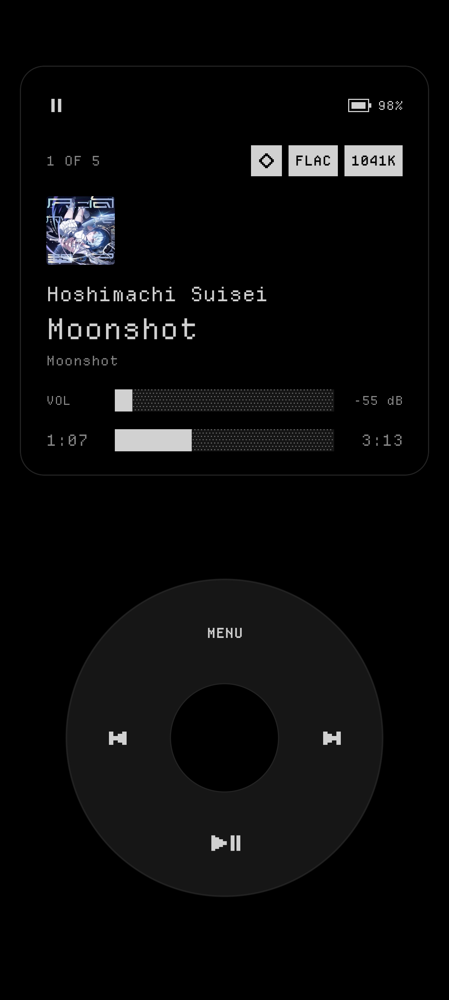
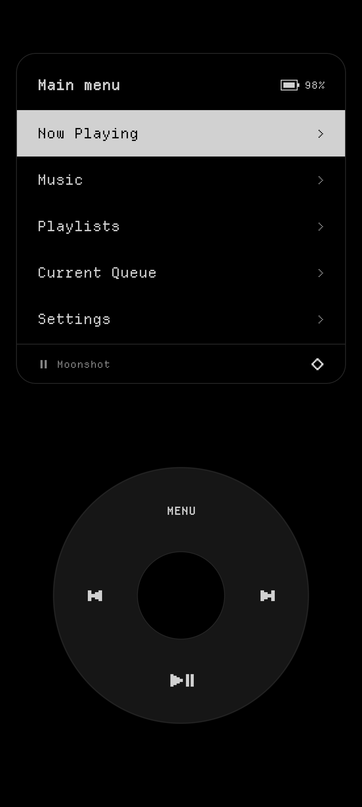
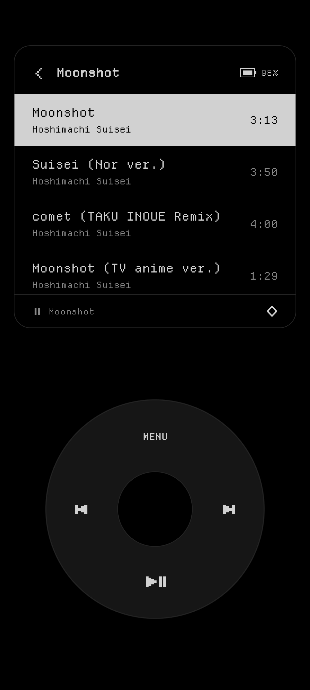
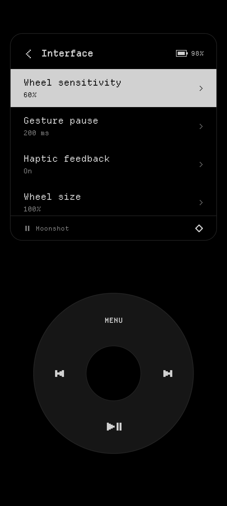

# Cymatic

A minimal Android music player with a click wheel interface, pixel typography,
and direct USB DAC playback.

## Screenshots

| Now Playing | Main menu |
| --- | --- |
|  |  |

| Album tracks | Interface settings |
| --- | --- |
|  |  |

## Features

- **Click wheel player:** rotate to browse lists or adjust playback volume; use the
  center button to select, Menu to return home, and the outer buttons for playback.
- **Music library:** browse tracks, artists, albums, playlists, and the current queue.
- **Pixel interface:** monochrome light and dark themes, pixel icons, and scrolling
  track names with ellipses at clipped edges.
- **Interface controls:** adjust wheel size and sensitivity, screen padding, haptics,
  text scrolling, cover-art visibility, and screen-awake behavior.
- **Standby:** an optional idle timeout blanks the player display. Touch wakes it,
  and the same touch can continue into a wheel gesture.
- **Audio profiles:** remember volume per output device, with separate normal and
  direct USB volume levels, plus equalizer presets per device.
- **Library sync:** download music from a configured server for local playback.
- **DSD/DSF:** play mono/stereo DSF files through PCM conversion or bit-perfect
  DSD over PCM (DoP) on a compatible USB DAC.

## Install

Requires **Android 12 or newer**.

Download `cymatic-player-v<version>.apk` from
[GitHub Releases](https://github.com/PXR05/cymatic/releases/latest) and install it on your device.

Grant music access, then use **Settings → Storage** to scan your music. You can scan
all media or choose individual directories. **Settings → Interface**
contains the wheel, display-padding, scrolling, and standby controls.

## Wheel controls

Start a gesture on the outer ring and move around it to scroll. On Now Playing,
the same motion adjusts volume. You can also tap the displayed list items directly.

| Control | Browsing | Now Playing |
| --- | --- | --- |
| Center | Select the highlighted item | Return to the music browser |
| Menu | Return to the main menu | Return to the main menu |
| Previous | Go back | Previous track |
| Next | Select the highlighted item | Next track |
| Play/Pause | Open Now Playing | Toggle playback |

Hold Menu for quick settings. Hold the center button on Now Playing for track
actions, or while browsing for the selected item's context menu.

**Track actions → Output info** has separate pages for the overview, format and
decoder, processing, device and volume, USB stream health, and recent errors and
events. Rotate to browse pages and scroll their details; select to return. Choose
**Copy report** to copy the diagnostic text. Hardware details that Android cannot
observe are marked explicitly.

## Direct USB audio

Connect a USB DAC and enable **Settings → USB audio → Direct USB**, then allow USB
access when prompted. The hollow diamond indicates that direct USB output is active.

Direct USB supports mono/stereo PCM WAV, FLAC (including Ogg FLAC), ALAC in M4A/MP4,
MP3, and Ogg Vorbis/Opus. Lossy formats use Android decoders with 16-bit PCM output
at the codec's sample rate. Unsupported tracks or DAC configurations fall back to
Android playback.

### DSD playback

DSF files support DSD64, DSD128, DSD256, and DSD512, including their 48 kHz-family
rates. Normal playback converts DSD to 24-bit PCM at 176.4 or 192 kHz. Direct USB
uses DoP for DSD64/128 when the DAC supports its carrier rate, and PCM conversion
otherwise. DoP is a transport for the original DSD bits; it does not convert them
to PCM audio. Higher DSD rates use PCM conversion with the current USB transport.

Under **Settings → USB audio → DSD output**, each DAC has an Automatic, Convert to
PCM, or DoP setting. Automatic recognizes the Amanero Combo384 interface; unknown
DACs use PCM. Select DoP when your DAC manufacturer confirms DoP support. A failed
DoP connection retries PCM, then falls back to Android output if needed.

If Android does not index your DSF files, add their folder under
**Settings → Storage → Add directory** and rescan. DSF title, artist, album,
duration, and embedded ID3 cover art are read by Cymatic.

## Project layout

| Module | Purpose |
| --- | --- |
| `app-player` | Standalone music player (`com.pxr.cymatic`) |
| `app-launcher` | Home-screen launcher (`com.pxr.cymatic.launcher`) |
| `shared/music` | Playback, library, playlists, EQ, and music screens |
| `shared/ui` | Themes, fonts, icons, components, and animations |
| `shared/usb` | Native USB isochronous PCM transport |
| `shared/flac` | Integer FLAC decoding for Android and direct USB playback |
| `shared/alac` | Integer ALAC decoding for Android and direct USB playback |
| `shared/dsd` | DSF DSD-to-PCM conversion and bit-perfect DoP packing |

## Build

Use JDK 21 and Android SDK 36.1. Open the repository in Android Studio, sync Gradle,
then select **Cymatic Player** in the Run dropdown.
The native USB, FLAC and ALAC modules use Android NDK 29.0.14206865 and CMake 3.22.1.
Codec sources are included for offline builds: libFLAC 1.5.0 and Apple's ALAC decoder with local bounds checks.

```bash
./gradlew :app-player:assembleDebug
```

The APK is in `app-player/build/outputs/apk/debug/`. Use
`:app-player:assembleRelease` for an unsigned release build.

## Checks and releases

```bash
./gradlew :shared:music:testDebugUnitTest :app-player:lintDebug
python scripts/verify_app_separation.py debug
```

Shared versions live in `gradle.properties`, dependencies live in
`gradle/libs.versions.toml`. CI builds both apps and signs both release APKs.

To release, increment `cymaticVersionCode`, update `cymaticVersionName` in
`gradle.properties`, and push to `main`. The Auto Tag workflow creates the version
tag automatically, then the Release workflow builds, signs, and publishes both APKs.
No manual tag is needed.

## Companion launcher

The repository also includes Cymatic Launcher, a home-screen app with pinned apps,
folders, music controls, and wallpaper effects. Its APK is released separately as
`cymatic-launcher-v<version>.apk`. It shares the Player's music code but keeps its
own settings and database; both apps can be installed together.
